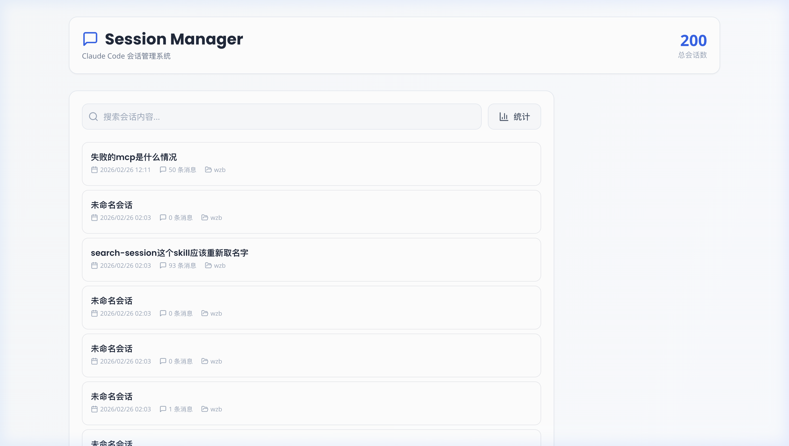
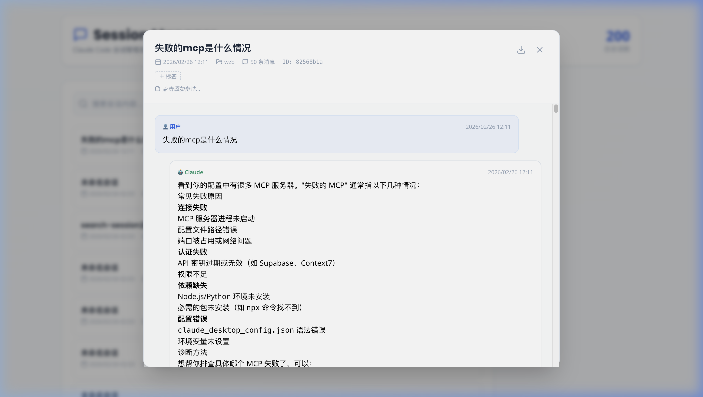
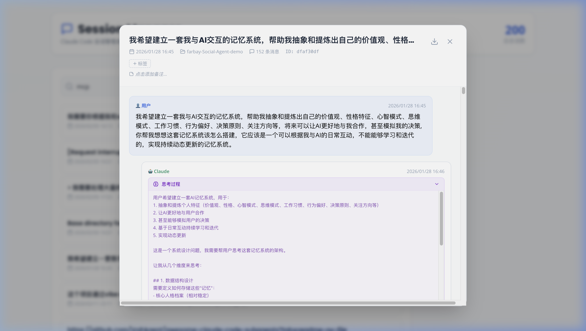

# 🗂️ Claude Code Session Manager Skill

> 一个 [Claude Code](https://docs.anthropic.com/en/docs/claude-code) **Skill**，为 Claude Code 提供完整的历史会话管理能力。

支持**浏览、搜索、查看完整对话内容（含思考过程/工具调用/命令行）、导出、删除、标签管理、备注、统计分析**等功能，提供可视化 Web 界面和命令行两种使用方式。

 

## 📸 界面预览

### 会话列表



### 会话详情 — 完整对话内容



### 思考过程展开



## ✨ 功能特性

### Web UI

<table>
<tr>
<td>📋 <b>会话列表</b></td>
<td>分页浏览所有历史会话，支持多选操作</td>
</tr>
<tr>
<td>🔍 <b>智能搜索</b></td>
<td>关键词搜索会话内容</td>
</tr>
<tr>
<td>💬 <b>完整对话</b></td>
<td>查看用户消息、Claude 回复、思考过程、工具调用、终端命令</td>
</tr>
<tr>
<td>🏷️ <b>标签管理</b></td>
<td>为会话添加标签，按标签筛选</td>
</tr>
<tr>
<td>📝 <b>备注功能</b></td>
<td>为会话添加备注说明</td>
</tr>
<tr>
<td>📊 <b>统计面板</b></td>
<td>按项目、按月份统计会话数量</td>
</tr>
<tr>
<td>💾 <b>导出</b></td>
<td>导出为 Markdown / JSON / TXT 格式</td>
</tr>
<tr>
<td>🗑️ <b>安全删除</b></td>
<td>删除前确认，自动备份到回收站，支持批量删除</td>
</tr>
<tr>
<td>☑️ <b>多选操作</b></td>
<td>全选、批量导出、批量删除</td>
</tr>
</table>

### 命令行

```bash
SM="python3 scripts/session_manager.py"

# 列出最近会话
$SM list
$SM list -n 30 -d 7 -p myproject

# 搜索
$SM search "docker 部署"

# 查看会话内容
$SM show <session_id>
$SM show <session_id> --full

# 导出
$SM export <session_id> -f md
$SM export --all -f md -o ~/exports/

# 删除（自动备份）
$SM delete <session_id>

# 标签管理
$SM tag <session_id> work llm
$SM tag --list
$SM tag --filter work

# 备注
$SM note <session_id> "这是备注"

# 统计
$SM stats
$SM stats --by-project
```

## 🚀 快速开始

### 前置要求

- [Claude Code](https://docs.anthropic.com/en/docs/claude-code)
- Python 3.7+
- Node.js 16+（Web UI 需要）

### 安装 Skill

```bash
# 克隆到 Claude Code skills 目录
git clone https://github.com/WZB021120/claude-code-session-manager-skill.git ~/.claude/skills/session-manager

# 安装 Python 依赖
pip3 install flask flask-cors

# 安装前端依赖（Web UI 需要）
cd ~/.claude/skills/session-manager/assets/web
npm install
```

安装后 Claude Code 会自动识别 `SKILL.md`，你可以直接在对话中让 Claude 管理你的会话记录。

### 什么是 Claude Code Skill？

Skill 是 Claude Code 的模块化扩展包，放在 `~/.claude/skills/` 目录下即可自动加载。Claude 会根据 `SKILL.md` 中的 `description` 判断何时使用该 Skill，无需手动触发。

### 启动 Web UI

**方式一：一键启动**

```bash
cd ~/.claude/skills/session-manager
./scripts/start-web.sh
```

**方式二：手动启动**

```bash
# 终端 1：启动后端 API
cd ~/.claude/skills/session-manager
python3 scripts/api.py

# 终端 2：启动前端
cd ~/.claude/skills/session-manager/assets/web
npm run dev
```

然后访问 **http://localhost:3000**

## 📁 项目结构

```
session-manager/
├── SKILL.md                       # Claude Code Skill 定义文件
├── README.md                      # 项目说明
├── scripts/                       # 可执行脚本
│   ├── session_manager.py         # 命令行工具主程序
│   ├── search_session.py          # 搜索引擎（AI 语义搜索）
│   ├── api.py                     # Flask Web API 服务器
│   ├── start-web.sh               # 一键启动脚本
│   └── config.yaml                # API 配置
└── assets/                        # 资源文件
    ├── screenshots/               # 界面截图
    └── web/                       # React 前端项目
        ├── src/
        │   ├── App.jsx
        │   ├── main.jsx
        │   └── index.css
        ├── index.html
        ├── package.json
        ├── vite.config.js
        └── tailwind.config.js
```

## 🔌 API 接口

| 方法 | 路径 | 说明 |
|------|------|------|
| `GET` | `/api/sessions?page=1&page_size=20` | 获取会话列表（分页） |
| `GET` | `/api/sessions/:id` | 获取会话详情（含完整对话） |
| `DELETE` | `/api/sessions/:id` | 删除单个会话 |
| `POST` | `/api/sessions/batch-delete` | 批量删除会话 |
| `GET` | `/api/sessions/:id/export?format=md` | 导出会话 |
| `GET` | `/api/search?q=关键词` | 搜索会话 |
| `GET` | `/api/stats` | 获取统计信息 |
| `POST` | `/api/sessions/:id/tags` | 添加标签 |
| `DELETE` | `/api/sessions/:id/tags` | 移除标签 |
| `GET` | `/api/sessions/:id/note` | 获取备注 |
| `POST` | `/api/sessions/:id/note` | 设置备注 |
| `DELETE` | `/api/sessions/:id/note` | 清除备注 |

### 会话详情响应示例

会话详情返回结构化的消息块 (`blocks`)，支持以下类型：

- **text** — 普通文本内容（Markdown 格式）
- **thinking** — Claude 的思考过程
- **tool_use** — 工具调用（Bash 命令、文件读写等）
- **tool_result** — 工具执行结果

## 🛠️ 技术栈

**前端**：React 18 + Vite + Tailwind CSS + Lucide Icons + react-markdown

**后端**：Python Flask + Flask-CORS

**数据源**：直接读取 `~/.claude/projects/` 目录下的 JSONL 会话文件

## 💡 常见问题

**Q: 支持短 ID 吗？**

A: 是的，所有命令和 API 均支持前 8 位短 ID，无需输入完整 UUID。

**Q: 删除会话会丢失数据吗？**

A: 不会，删除的会话会自动备份到 `trash/` 目录。

**Q: 数据存储在哪里？**

A: 会话数据来自 Claude Code 自身存储的 `~/.claude/projects/` 目录。标签和备注存储在 `session_meta.json` 文件中。

## 📄 许可证

MIT License

---

**版本**: 2.0.0 | **作者**: [WZB](https://github.com/WZB021120) | **更新时间**: 2026-02-26
